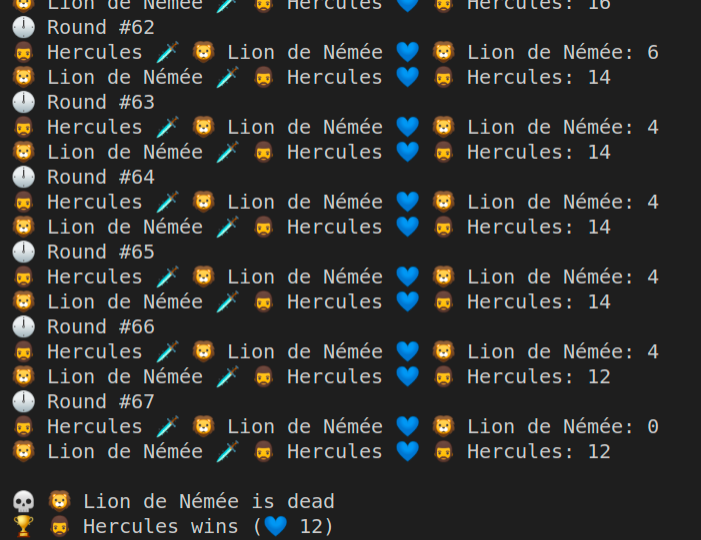

# Les travaux d'Héraclès : le lion de Némée

Démarrage : cloner ce *repository*.
{: .alert-info }

## Préparation

Héraclès doit vaincre le féroce lion de Némée, connu pour sa peau impénétrable, le rendant très difficile à blesser. Avant de débuter sa quête, tout héros doit se préparer un peu :

Créer une classe `Fighter` (dans le fichier vide *src/Fighter.php*) avec :

- la constante
    - `MAX_LIFE = 100` : les combattants ont 100 points de vie max

- les propriétés
    - `name` : le nom du combattant.
    - `strength` : la force du combattant (permettra de calculer les points de dégâts lors d’une attaque)
    - `dexterity` : la dextérité du combattant (permettra de calculer les points de défense qui viendront limiter les dégâts reçus)
    - `life` : les points de vie du combattant (initialisé à `MAX_LIFE`, ainsi ils débutent tous avec 100 point de vie.)

Il y aurait potentiellement plein d’autres choses à ajouter mais pour un début c’est déjà pas mal !

Ensuite, dans le fichier fourni *index.php*, créer deux instances de la classe `Fighter`, pour :

- 🧔 Héraclès, force de 20, dextérité de 6

- 🦁 Lion de Némée, force de 11, dextérité de 13

Pour avoir un rendu un peu plus sympathique en attendant de travailler dans le navigateur, tu peux ajouter une icône dans la chaîne de caractères du nom (https://emojipedia.org/).
Tu peux également t'amuser à faire varier les valeurs, mais celles fournies te donneront des combats relativement équilibrés.

💡 **HINT** : un *constructeur* va être nécessaire dans ta classe pour initialiser ces propriétés avec des valeurs différentes pour Héraclès et le Lion.
{: .alert-info}

💡 **HINT** : n’oublie pas de faire un *require* de ton fichier *Fighter.php* si tu veux pouvoir l’utiliser depuis ton fichier *index.php*.
{: .alert-info }

Une fois les deux objets instanciés, affiche le nom et la vie 💙 (tu dois avoir 100 au départ) de chacun des deux combattants pour t’assurer que tout fonctionne bien. Pour l'instant, tu vas utiliser PHP uniquement en mode CLI (pas besoin de lancer de serveur PHP).
Pour se faire tape juste dans ton terminal la commande suivante :
```bash
php index.php
``` 

## 🧔 Fight! 🦁

Héraclès s'échauffe un peu, bande ses muscles, écrase quelques rochers à main nue. Il est prêt à en découdre !

Créé une méthode `fight()` qui va te permettre d’attaquer l’ennemi. Pour déterminer qui tu vas taper, la méthode `fight()` va prendre en paramètre un autre objet Fighter ! Dans le corps de ta méthode, tu vas calculer tout d'abord le nombre de point de dégats de l'attaquant.

- Le combattant va taper plus ou moins fort à chaque fois, le nombre de point de dégâts que fait l'**attaquant** sera donc un nombre aléatoire compris entre 1 et la force du combattant (utilise la fonction `rand()` ([Documentation](https://www.php.net/manual/fr/function.rand.php))

- Mais l'attaqué peut se défendre et esquiver ! Tu vas donc atténuer les dégâts en soustrayant aux dommages, la dextérité de l'**attaqué** (sans **jamais aller en dessous de zéro**)

- Une fois les dégats calculés, diminue le nombre de points de vie de l'**attaqué** par la valeur ainsi obtenue. Attention, la vie d’un combattant **ne peut pas tomber en dessous de zéro**, pense également à vérifier cela.

**En résumé**  :  
Nouveaux points de vie de l’attaqué = points de vie actuels de l’attaqué – (dommage de l’attaquant – défense de l’attaqué).  
{: .alert-info}

Sachant que `(dommage de l’attaquant – défense de l’attaqué)` ne doit pas être négatif.
{: .alert-warning}


Voilà, ta classe est prête, tu n’as plus qu’à l’utiliser !

## 🗡️ Il n’en restera qu’un

Héraclès pénètre dans la grotte, le lion est là, ses yeux rouges pointés vers l’intrus. Le combat est imminent.

1. Dans le fichier *index.php*, créé une boucle permettant d’effectuer un combat à mort ! Tant qu’un des deux ennemis a une vie > 0, le combat continue donc.

2. À chaque "round" 🕛, Héraclès attaque le lion, puis le lion attaque Héraclès. Tu dois afficher le numéro du round, qui attaque qui, et les points de vie restants. 

3. Une fois l’un des deux vaincus, tu dois alors afficher le vainqueur 🏆 et le perdant 💀. La capture d’écran ci-dessous te résume ce qui est attendu.


{: .text-center }

## 🎁 Bonus
Crée une nouvelle méthode `isAlive()` peut t’aider à optimiser le code.

## Conclusion

Une fois que tu as fini, n’hésite pas à modifier le code et à ajouter de nouvelles fonctionnalités.
Un code "propre" te sera fourni au début du prochain atelier.
